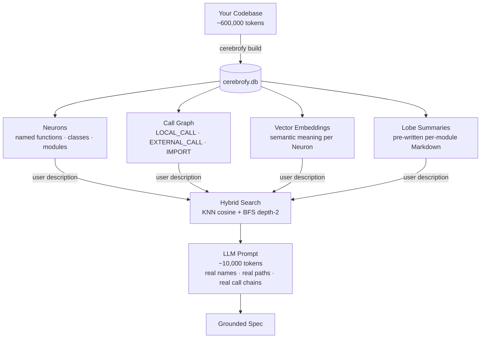

<!-- markdownlint-disable MD040 MD041 MD033 MD060 -->
<p align="center">
  
</p>

<div align="center">

[](https://pypi.org/project/cerebrofy/)
[](https://pypi.org/project/cerebrofy/)
[](https://pypi.org/project/cerebrofy/)
[](https://pypi.org/project/cerebrofy/)
[](https://github.com/mm0rsy/Cerebrofy/actions/workflows/ci.yml)
[](LICENSE)
[](https://github.com/mm0rsy/Cerebrofy/blob/master/docs/mcp-integration.md)
[](https://tree-sitter.github.io/)
[](https://huggingface.co/BAAI/bge-small-en-v1.5)
[](https://github.com/asg017/sqlite-vec)
[](https://docs.astral.sh/uv/)
[](https://github.com/mm0rsy/Cerebrofy#platform-support)
[](https://claude.ai)

</div>

---

<p align="center">
  
</p>

---

# 🧠 Cerebrofy

**AI-powered codebase intelligence CLI.**  
Cerebrofy indexes your repository into a local graph + vector database, then exposes it to AI assistants via MCP — letting them navigate your codebase with surgical precision instead of reading entire files. Zero code uploaded to any server.

```
cerebrofy init && cerebrofy build
# → Parses, graphs, embeds — one local index, ready for AI tools
cerebrofy validate
# → clean
```

---

## The Problem: LLM Context Is Expensive

When you ask an AI agent to help with a feature in a real codebase, the naive approach is to dump files into the context window. That approach has three problems:

- **Cost**: a 20,000 LOC codebase is ~600,000 tokens per query
- **Noise**: the LLM reads code that is irrelevant to the task
- **Hallucination**: without structural grounding, the LLM guesses at call relationships and import paths

Cerebrofy solves this by pre-computing a structural + semantic index of your code. Instead of dumping files, it gives the LLM exactly what it needs:

| What the LLM receives | Token count | How it's selected |
|-----------------------|-------------|-------------------|
| 10 matched Neuron signatures | ~500 tokens | KNN cosine similarity search |
| Their depth-2 call graph | ~800 tokens | BFS over the `edges` table |
| 2–3 pre-written lobe summaries | ~8,000 tokens | Affected lobe `.md` files |
| **Total** | **~10,000 tokens** | vs. ~600,000 for raw files |

**~97% token reduction** on a typical mid-size codebase. The LLM gets a precise, grounded, zero-hallucination view of the code it actually needs — not a random 20-file dump.

### How Cerebrofy Grounds the LLM



The call graph answers the question an LLM cannot answer from code alone: **"if I change this function, what else breaks?"** Cerebrofy computes this once at build time with O(1) edge lookups — no approximation, no guessing.

---

## How It Works

Cerebrofy builds a **structural + semantic index** of your code in one SQLite file (`.cerebrofy/db/cerebrofy.db`):

1. **Parse** — Tree-sitter extracts named functions, classes, and modules as *Neurons*
2. **Graph** — Call relationships become typed edges (`LOCAL_CALL`, `EXTERNAL_CALL`, `RUNTIME_BOUNDARY`)
3. **Embed** — Each Neuron is embedded into a `sqlite-vec` vector table for semantic search
4. **Query** — Hybrid search (KNN cosine + BFS depth-2) finds affected code units for any description
5. **Expose** — An MCP stdio server lets AI clients trigger builds, run drift checks, and update the index

No cloud index. No code upload. One file, one connection.

---

## Platform Support

Cerebrofy runs on **Linux**, **macOS**, and **Windows**. All commands (`init`, `build`, `update`, `validate`, `viz`, `mcp`) behave identically across platforms with one prerequisite difference:

| Platform | Prerequisites | Notes |
|---|---|---|
| Linux / macOS | Python 3.11+, Git | No extra setup |
| Windows | Python 3.11+, **[Git for Windows](https://git-scm.com/download/win)** | Required for git hook execution (MSYS bash) |

> **Windows users:** Install [Git for Windows](https://git-scm.com/download/win) before running `cerebrofy init`. Git for Windows bundles MSYS bash, which is what runs the installed git hooks. Without it, `cerebrofy init` succeeds but the pre-commit / pre-push / post-merge hooks will not fire.

---

## Installation

### Recommended: `uv tool install`

```bash
# Base install — includes local embeddings (BAAI/bge-small-en-v1.5, offline)
uv tool install cerebrofy

# With MCP server support (Claude Desktop, Cursor, VS Code, etc.)
uv tool install "cerebrofy[mcp]"
```

> **Note:** Embeddings are bundled in the base install via `fastembed`. No extra required for `cerebrofy build` or `cerebrofy update`. The only optional extra is `[mcp]`.

### Alternative installers

```bash
pip install cerebrofy
pipx install cerebrofy

# With MCP
pip install "cerebrofy[mcp]"
pipx install "cerebrofy[mcp]"
```

### From source

```bash
git clone https://github.com/mm0rsy/cerebrofy
cd cerebrofy
uv sync --group dev
```

Run tests:

```bash
# Unit + integration tests (no MCP)
uv run pytest tests/unit/ tests/integration/test_update_command.py \
  tests/integration/test_validate_command.py tests/integration/test_migrate_command.py

# Full suite including MCP integration tests
uv sync --extra mcp --group dev
uv run pytest
```

---

## Quick Start

**Three commands, then git handles everything automatically:**

```bash
# Step 1 — one time per repo
cerebrofy init

# Step 2 — one time after init (takes ~30s on a typical codebase)
cerebrofy build

# Step 3 — optional: wire your AI client so it uses the index instead of reading files
cerebrofy init --ai claude      # writes navigation rules to CLAUDE.md
cerebrofy init --ai copilot     # writes rules to .github/copilot-instructions.md
cerebrofy init --ai opencode    # writes rules to .opencode/instructions.md
```

**That's it.** From here, `cerebrofy update` runs automatically on every `git commit` (via the installed pre-commit hook) and the index is validated before every `git push`. You never need to run `cerebrofy update` manually.

```
your workflow:
  code → git commit  →  index auto-updated  ✓
                ↓
           git push   →  index validated     ✓
```

> **First time on a new machine?** After cloning a repo that already has cerebrofy:
> ```bash
> cerebrofy init   # re-installs hooks
> cerebrofy build  # builds your local index from scratch
> ```

Once the index is built, AI assistants with MCP configured can call all six tools directly — see [MCP Tools](#mcp-tools).

---

## Commands

### `cerebrofy init`

Scaffold `.cerebrofy/`, auto-detect Lobes, install git hooks, and register the MCP server.

```bash
cerebrofy init                           # Local MCP registration (default)
cerebrofy init --global                  # Register MCP globally (~/.config/mcp/servers.json)
cerebrofy init --no-mcp                  # Skip MCP registration
cerebrofy init --force                   # Re-initialize, overwrite MCP entry with current binary path
cerebrofy init --ai claude               # Also write AI navigation rules to CLAUDE.md
cerebrofy init --ai copilot              # Also write rules to .github/copilot-instructions.md
cerebrofy init --ai vscode               # Same as --ai copilot
cerebrofy init --ai opencode             # Also write rules to .opencode/instructions.md
```

**What it creates:**

```
.cerebrofy/
├── config.yaml          ← Lobe map, tracked extensions, embed model
├── db/                  ← cerebrofy.db lives here (gitignored)
└── queries/             ← Tree-sitter .scm files per language
.cerebrofy-ignore        ← Ignore rules (gitignore syntax)
.gitignore               ← .cerebrofy/db/ appended automatically
.git/hooks/pre-commit    ← Auto-runs cerebrofy update on every commit (silent, never blocks)
.git/hooks/pre-push      ← Validates index before push; auto-updates if drift detected
.git/hooks/post-merge    ← state_hash sync check after git pull
```

The `--ai` flag appends a fenced navigation rules block to the target instructions file. The block is idempotent — re-running replaces the existing block rather than appending a second copy.

---

### `cerebrofy build`

Full atomic re-index of the repository.

```bash
cerebrofy build
```

Writes to `cerebrofy.db.tmp`, swaps atomically to `cerebrofy.db` only on success. An interrupted build leaves no corrupted state. Runs 6 steps:

| Step | Action |
|------|--------|
| 0 | Create `.tmp` database, apply schema |
| 1 | Parse all tracked source files → Neurons |
| 2 | Build intra-file call graph (LOCAL\_CALL edges) |
| 3 | Resolve cross-module calls (EXTERNAL\_CALL, IMPORT, RUNTIME\_BOUNDARY edges) |
| 4 | Generate embeddings for all Neurons (`BAAI/bge-small-en-v1.5`, 384-dim, offline) |
| 5 | Commit file hashes + state\_hash, atomic swap |
| 6 | Write per-lobe Markdown docs and `cerebrofy_map.md` |

---

### `cerebrofy update`

Partially re-index only changed files — target latency < 2s for a single-file change.

```bash
cerebrofy update                        # Auto-detect via git
cerebrofy update src/auth/login.py      # Explicit file list
```

Detects changes via `git diff` (falls back to file hash comparison in non-git repos). Uses depth-2 BFS to find and re-index all affected neighbors. All writes are wrapped in a single `BEGIN IMMEDIATE` transaction — on failure, full rollback.

After a successful update that completes in under 2 seconds, the pre-push git hook is automatically upgraded from warn-only (v1) to hard-block (v2).

---

### `cerebrofy validate`

Classify drift between the index and current source.

```bash
cerebrofy validate
```

Exit codes:

| Code | Meaning |
|------|---------|
| 0 | Index is clean, or minor drift (whitespace/comments only) |
| 1 | Structural drift — function added, removed, renamed, or signature changed |

This command is also invoked automatically by the pre-push git hook.

---

### `cerebrofy blast-radius`

Compute the blast radius of a function or class — every caller at depth 1 and 2, test coverage gaps, lobe spread, and a risk score.

```bash
cerebrofy blast-radius validate_token
cerebrofy blast-radius src/auth/tokens.py::validate_token --depth 3
cerebrofy blast-radius validate_token --format markdown   # PR comment format
```

---

### `cerebrofy context`

Build the optimal context window for a coding task within a token budget. Uses KNN + BFS to find relevant Neurons, then greedy-packs them by relevance with tier degradation. JSON output includes a full epistemic confidence payload (`overall_confidence`, `neurons_changed_since_build`, `unindexed_languages`, etc.).

```bash
cerebrofy context "add rate limiting to the payments API"
cerebrofy context "refactor auth module" --budget 12000
cerebrofy context "fix token expiry bug" --output claude-xml
```

---

### `cerebrofy epistemic`

Show the epistemic confidence score and staleness warnings for the current index.

```bash
cerebrofy epistemic
cerebrofy epistemic --json   # machine-readable output for agent consumption
```

---

### `cerebrofy health`

Show longitudinal codebase health metrics derived from the call graph, with deltas vs the previous build.

```bash
cerebrofy health                      # current snapshot vs last build
cerebrofy health --history 30         # last 30 builds in a table
cerebrofy health --trend coupling     # ASCII sparkline for a metric over time
cerebrofy health --export json        # machine-readable snapshot
cerebrofy health --watch              # live-update: re-renders after each build
```

---

### `cerebrofy memory`

Write and query structured memories attached to neurons and lobes. Memories persist across full rebuilds in a separate `memories.db` and decay over time using a configurable half-life (default 70 days). Stale memories are surfaced in the epistemic confidence score.

```bash
cerebrofy memory add "Clock skew breaks token expiry" \
    --type warning --neuron auth/tokens.py::validate_token --tags "security,jwt"
cerebrofy memory search "JWT expiry edge cases" --lobe auth
cerebrofy memory list --lobe auth --type warning
cerebrofy memory link <from-id> <to-id> --rel motivated
cerebrofy memory export --format markdown > DECISIONS.md
```

---

### `cerebrofy intent`

Manage the product intent declaration file (`.cerebrofy/intent.yaml`) — sprint goals, incidents, architectural direction.

```bash
cerebrofy intent init        # scaffold intent.yaml with commented sections
cerebrofy intent show        # display current intent (human-readable)
cerebrofy intent show --json # machine-readable for agent consumption
cerebrofy intent edit        # open in $EDITOR
cerebrofy intent validate    # check YAML + validate lobe names against graph
```

---

### `cerebrofy mcp`

Start the MCP stdio server. Used by AI tools (Claude Desktop, Cursor, VS Code, etc.) — not invoked manually.

```bash
cerebrofy mcp    # requires: uv tool install "cerebrofy[mcp]"
```

Exposes eighteen fully operational tools. See [docs/mcp-integration.md](docs/mcp-integration.md) for full setup.

---

### `cerebrofy viz`

Launch an interactive **3D brain visualization** of your codebase's call graph in the browser.

```bash
cerebrofy viz
# → Serving at http://localhost:7331
```

Each node is a function, class, or module. Color encodes its position in the call graph:

| Color | Meaning |
|-------|---------|
| 🔴 Red | Pure sources — entry points called by nothing (CLI commands, top-level scripts) |
| 🟠 Orange / 🟡 Yellow | Mid-graph — both call and are called |
| 🟢 Green | Pure leaves — utilities called by others, call nothing |
| 🟤 Grey-gold | Isolated — no edges in the filtered graph |

Nodes are distributed throughout the **full brain interior** using volumetric sphere sampling. Source nodes are placed at the cortex surface. Clicking any node shows its docstring and metadata in a side panel.

Works on any cerebrofy-indexed Python project — no project-specific configuration required.

---

### `cerebrofy impact`

Predict the full blast radius of a refactor **before touching any code**. Runs BFS caller traversal, maps test coverage, estimates lines of code affected, and produces a recommended refactoring sequence.

```bash
cerebrofy impact auth/tokens.py::validate_token
cerebrofy impact validate_token --depth 3
cerebrofy impact auth/tokens.py:42 --no-sequence
cerebrofy impact auth/tokens.py::validate_token --output json
```

| Output field | Meaning |
|---|---|
| **Callers (Depth 1/2)** | Direct and transitive callers via BFS |
| **Lobes Crossed** | Number of architectural boundaries the change touches |
| **Estimated LoC** | Lines of code across all affected neurons |
| **Complexity Rating** | 🟢 LOW / 🟡 MEDIUM / 🔴 HIGH |
| **Memory Warnings** | `warning` memories attached to the target from `cerebrofy memory` |
| **Refactoring Sequence** | Reverse-topological order — update callers leaf-first to minimise breakage |

---

### `cerebrofy onboard`

Generate a personalized **onboarding guide** from the cerebrofy index — a topology-derived reading order, entry points, complexity hotspots, and safe zones for any developer joining the project.

```bash
cerebrofy onboard                          # generates .cerebrofy/ONBOARDING.md
cerebrofy onboard --name "Alice"           # personalized welcome header
cerebrofy onboard --focus auth             # restrict guide to the auth lobe
cerebrofy onboard --format html            # self-contained interactive HTML
cerebrofy onboard --depth senior           # skip basics, focus on architecture
cerebrofy onboard --output ~/ONBOARDING.md # write to a custom path
```

The guide includes:

| Section | Source |
|---------|--------|
| **Reading Order** | Topological sort of lobes by call-graph dependency |
| **Entry Points** | Neurons with `in_degree == 0 && out_degree > 0` (CLI commands, event handlers) |
| **Hotspots** | Top-10 functions by blast radius — understand these before touching them |
| **Safe Zones** | Lobes with low coupling and low blast radius — start contributing here |
| **Things to Know** | `warning` and `decision` memories attached to high-traffic neurons |

Output is written to `.cerebrofy/ONBOARDING.md` (or `.cerebrofy/ONBOARDING.html` with `--format html`). The HTML output is fully self-contained with zero external dependencies.

---

### `cerebrofy vuln`

Map which of **your** functions are exposed to a vulnerable package — before patching anything. Finds every call site via the call graph, traces backward to trust boundary entry points, scores exposure, and produces a prioritised remediation sequence.

```bash
cerebrofy vuln --package requests
cerebrofy vuln --package requests --function requests.get
cerebrofy vuln --package pyyaml --write-memories
cerebrofy vuln --package requests --depth 3 --output json
```

| Output field | Meaning |
|---|---|
| **Direct Callers** | Neurons with a `RUNTIME_BOUNDARY` edge to the package |
| **Critical Exposure** | Entry points where external input reaches the vulnerable call (`exposure_score 1.0 / 0.6`) |
| **Low Exposure** | Internal callers with no detected external input path (tests, utilities) |
| **Pinned Version** | Version pinned in `pyproject.toml` / `requirements.txt` — compare against CVE advisory manually |
| **Remediation Sequence** | Patch highest-exposure entry points first, then pin the safe package version |
| **Memories Written** | Warning memories auto-attached to each affected neuron (with `--write-memories`) |

---

### `cerebrofy silo`

Identify knowledge silos — functions with high blast radius owned by few contributors. Overlays `git blame` authorship on the call graph to compute bus factor risk: a function called by many but written by one is a single point of failure.

```bash
cerebrofy silo                              # full report, top 20 silos
cerebrofy silo --top 10 --min-callers 3    # high-traffic functions only
cerebrofy silo --lobe auth                 # restrict to a specific lobe
cerebrofy silo --author alice@company.com  # "if Alice left, what breaks?"
cerebrofy silo --risk high                 # show only HIGH/CRITICAL silos
cerebrofy silo --write-memories            # attach warning memories to HIGH/CRITICAL neurons
cerebrofy silo --output json               # machine-readable output
```

| Output field | Meaning |
|---|---|
| **Silo score** | `caller_count ÷ unique_authors` — higher = more dangerous concentration |
| **Primary owner** | Author with the most lines in the neuron's line range |
| **Own%** | Fraction of lines owned by the primary author |
| **Unique authors** | Number of distinct contributors to this neuron |
| **Risk** | CRITICAL (≥20) / HIGH (≥8) / MEDIUM (≥3) / LOW (<3) |
| **Memories written** | Warning memories auto-attached to each HIGH/CRITICAL neuron (with `--write-memories`) |

---

### `cerebrofy coverage-gap`

Rank uncovered neurons by **blast radius × change velocity** to surface functions most likely to cause production bugs. A function that is widely-called, actively changing, and has no tests is the highest-priority coverage gap.

Coverage is sourced from `coverage.xml` (pytest-cov) when present; otherwise derived from the call graph (any test file with an edge to the neuron). The `coverage_source` field in every result tells you which was used.

```bash
cerebrofy coverage-gap                          # top 20 gaps, 30-day velocity window
cerebrofy coverage-gap --days 14               # tighten velocity to 2 weeks
cerebrofy coverage-gap --min-blast 2           # only functions with meaningful blast radius
cerebrofy coverage-gap --lobe auth             # restrict to a specific lobe
cerebrofy coverage-gap --risk critical         # show only CRITICAL gaps
cerebrofy coverage-gap --write-memories        # attach warning memories to HIGH/CRITICAL neurons
cerebrofy coverage-gap --output json           # machine-readable output
```

| Output field | Meaning |
|---|---|
| **Gap score** | `risk_score(blast_radius) × velocity` — higher = more dangerous gap |
| **Callers** | Total callers at depth 1+2 from BFS traversal |
| **Commits/Nd** | Git commits touching the file in the last N days (velocity) |
| **Coverage source** | `coverage_xml` (pytest-cov) or `graph_topology` (call-edge fallback) |
| **Risk** | CRITICAL (≥100) / HIGH (≥25) / MEDIUM (≥5) / LOW (<5) |
| **Memories written** | Warning memories auto-attached to each HIGH/CRITICAL neuron (with `--write-memories`) |

---

### `cerebrofy migrate`

Run sequential schema migration scripts.

```bash
cerebrofy migrate
```

Scripts live in `.cerebrofy/scripts/migrations/`. Safe to run multiple times — already-applied migrations are skipped.

---

## MCP Tools

When configured via `cerebrofy init`, AI assistants can call these tools directly against your index:

| Tool | Description |
|------|-------------|
| `search_code` | Hybrid KNN + BFS semantic search — primary navigation tool. |
| `get_neuron` | Fetch a specific Neuron by name or file:line. |
| `list_lobes` | List indexed lobes with summary file paths. |
| `cerebrofy_context` | Build optimal context window for a task within a token budget. |
| `cerebrofy_blast_radius` | Compute every caller affected by a changed neuron + risk score. |
| `cerebrofy_epistemic` | Return index confidence score and staleness warnings. |
| `cerebrofy_health` | Longitudinal codebase health metrics from the call graph. |
| `cerebrofy_intent` | Return sprint goals, incidents, and architectural direction. |
| `cerebrofy_build` | Trigger a full atomic re-index from the AI client. |
| `cerebrofy_update` | Trigger an incremental re-index. Pass `path` to target a specific file. |
| `cerebrofy_validate` | Check for drift. Returns `clean`, `minor_drift`, or `structural_drift`. Zero writes. |
| `cerebrofy_remember` | Write a structured memory (insight, warning, decision) to the memory store. |
| `cerebrofy_recall` | Semantic search over stored memories. |
| `cerebrofy_memories` | List all memories, optionally filtered by lobe or type. |
| `cerebrofy_link_memories` | Create a directed link between two memories. |
| `cerebrofy_trace_history` | Trace the ancestry chain of a memory through its linked predecessors. |
| `cerebrofy_onboard` | Generate a topology-derived onboarding guide: reading order, entry points, hotspots, safe zones, and memory warnings. |
| `cerebrofy_impact` | Pre-change impact prediction: callers, test coverage, lobe spread, estimated LoC, memory warnings, and refactoring sequence. |
| `cerebrofy_vuln` | Vulnerability blast radius: find which of your functions call a vulnerable package, score exposure by trust boundary proximity, and generate a remediation sequence. |
| `cerebrofy_silo` | Knowledge silo detector: overlay git blame on the call graph to compute bus factor risk per neuron. Filter by lobe, author, or risk level. Pass `author` to answer "if this person left, what breaks?" |
| `cerebrofy_coverage_gap` | Test coverage gap predictor: rank uncovered neurons by blast radius × change velocity. Uses `coverage.xml` when present, falls back to graph topology. Surfaces the functions most likely to cause production bugs if a bug is introduced. |

All data-reading tools automatically include an `"epistemic"` field with the current confidence score, and an `"intent_context"` field if `.cerebrofy/intent.yaml` exists.

Full tool reference: [docs/mcp-integration.md](docs/mcp-integration.md)

---

## Lobes

A **Lobe** is a named module group — typically one top-level directory in your repository. Cerebrofy auto-detects Lobes at `cerebrofy init` time. Each Lobe gets a Markdown summary at `.cerebrofy/lobes/<name>_lobe.md`.

Lobes are configured in `.cerebrofy/config.yaml`:

```yaml
lobes:
  auth: src/auth/
  api: src/api/
  db: src/db/
```

The lobe name surfaces in MCP tool output (`"lobe": "auth"`) and in lobe summary files used as AI context.

---

## Embedding Model

Cerebrofy uses **`BAAI/bge-small-en-v1.5`** via `fastembed`:

| Property | Value |
|----------|-------|
| Dimensions | 384 |
| Format | ONNX (no PyTorch) |
| Size | ~130 MB (cached after first `cerebrofy build`) |
| Offline | Yes — no API key, no network after first download |
| Extra required | None — bundled in base install |

---

## Language Support

Cerebrofy uses Tree-sitter with `.scm` query files. Supported out of the box:

`Python` · `JavaScript` · `TypeScript` · `TSX` · `JSX` · `Go` · `Rust` · `Java` · `Ruby` · `C++` · `C`

To add a new language, add a `.scm` query file to `.cerebrofy/queries/` and add the extension to `tracked_extensions` in `config.yaml`. See [docs/architecture.md](docs/architecture.md#adding-language-support) for details.

---

## Git Hooks

Cerebrofy installs three hooks at `cerebrofy init` time:

| Hook | Trigger | Behavior |
|------|---------|----------|
| `pre-commit` | After every `git commit` | **Auto-runs `cerebrofy update`** silently. Never blocks commits. Index is always fresh. |
| `pre-push` | Before `git push` | Validates the index. If drift slipped through, auto-runs `cerebrofy update`. Blocks only if update fails. |
| `post-merge` | After `git pull` / merge | Compares remote `state_hash` against local index; warns if out of sync. |

All three hooks are installed by `cerebrofy init`. **You should never need to run `cerebrofy update` manually** — the pre-commit hook does it on every commit. The pre-push hook is a safety net for cases where the pre-commit hook wasn't installed or was bypassed.

### Windows

Hooks are written as POSIX `sh` scripts and executed by the MSYS bash shell that ships with **Git for Windows** — no extra configuration needed. If hooks don't appear to run after `cerebrofy init`, confirm that `git` on your PATH comes from Git for Windows (not WSL or another distribution).

---

## Configuration

Full reference: [docs/configuration.md](docs/configuration.md)

Quick example `.cerebrofy/config.yaml`:

```yaml
lobes:
  auth: src/auth/
  api: src/api/

tracked_extensions:
  - .py
  - .ts
  - .go

embedding_model: local      # local | none
```

---

## Output Files

| Path | Created by | Description |
|------|-----------|-------------|
| `.cerebrofy/db/cerebrofy.db` | `cerebrofy build` | Full index — graph + vectors |
| `.cerebrofy/lobes/<name>_lobe.md` | `cerebrofy build` / `update` | Per-lobe Neuron + call table |
| `.cerebrofy/cerebrofy_map.md` | `cerebrofy build` / `update` | Master index with `state_hash` |

The lobe `.md` and map files are committed to git (not gitignored). They form the human-readable index of your codebase and serve as AI context when used with MCP tools.

---

## MCP Integration

Cerebrofy ships an MCP stdio server with six fully operational tools.

```bash
# Install with MCP support
uv tool install "cerebrofy[mcp]"

# Initialize — auto-registers the MCP entry with the absolute binary path
cerebrofy init

# Re-register if the binary moved (e.g. after reinstall)
cerebrofy init --force
```

See [docs/mcp-integration.md](docs/mcp-integration.md) for client-specific registration, manual setup, and per-tool schemas.

---

## Multi-Developer Workflow

`cerebrofy.db` is a **local artifact — it is not committed to git** (`.cerebrofy/db/` is gitignored automatically by `cerebrofy init`). Each developer builds and maintains their own index. Synchronization uses `state_hash` in `cerebrofy_map.md`, which **is** committed.

| Event | What happens |
|-------|-------------|
| First clone | `.cerebrofy/` missing → run `cerebrofy init && cerebrofy build`. Pre-push hook warns but does not block. |
| Daily development | Edit code → `cerebrofy update` syncs the index in < 2s. Pre-push hook validates automatically. |
| `git pull` / merge | Post-merge hook compares remote `state_hash` (from pulled `cerebrofy_map.md`) against local index. Warns if they differ — run `cerebrofy build` to resync. |
| Embedding model change | Change `embedding_model` in `config.yaml` → run `cerebrofy build` to rebuild the vector table at the new dimension. |

---

## Performance Targets

*Engineering targets validated against real repositories, not guaranteed results.*

| Metric | Target |
|--------|--------|
| Token reduction | ~97% — 20k LOC (~600k tokens) → 10 matched Neurons + lobe context (~15k tokens) |
| Blast radius query | < 10ms — depth-2 BFS on 10,000-node graph via indexed SQLite |
| `cerebrofy update` latency | < 2s — single-file change, end-to-end including re-embedding |
| `cerebrofy build` | Linear in codebase size; local embedding model (~130MB, cached after first run) |

---

## Contributing

- [Architecture guide](docs/architecture.md) — module map, data flow, invariants, database schema
- [Adding language support](docs/architecture.md#adding-language-support) — `.scm` query file authoring
- Tests: `uv run pytest` after `uv sync --group dev`
- Lint: `uv run ruff check src/ tests/`
- Type check: `uv run mypy src/`

---

## License

MIT
