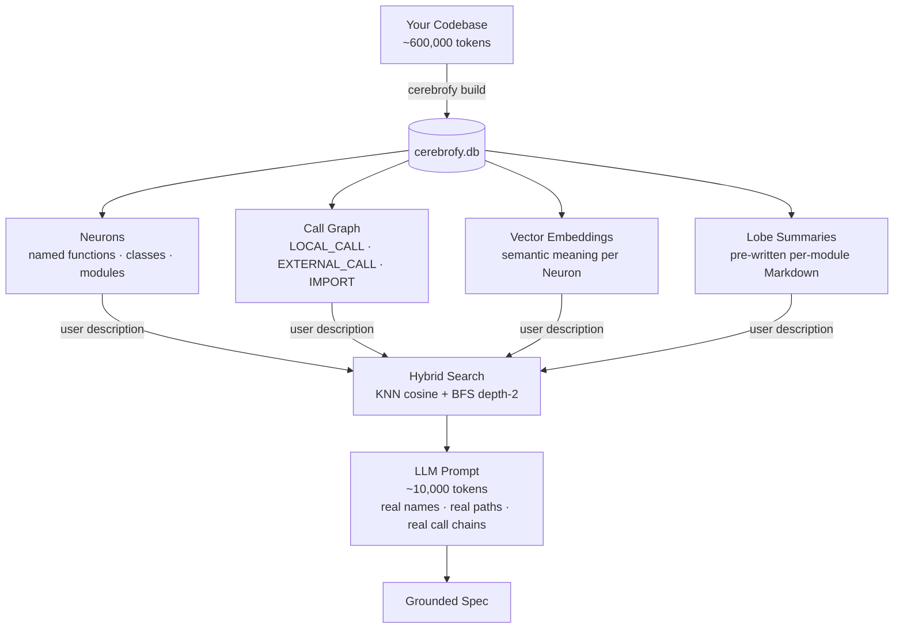

# 🧠 Cerebrofy

**AI-powered codebase intelligence CLI.**  
Cerebrofy indexes your repository into a local graph + vector database, then lets you explore it, plan changes, and generate AI-grounded feature specs — all from the command line, all with zero code uploaded to any server.

```
cerebrofy plan "add OAuth2 login"
# → Matched Neurons, Blast Radius, Affected Lobes, Re-index Scope
```

---

## The Problem: LLM Context Is Expensive

When you ask an AI agent to help with a feature in a real codebase, the naive approach is to dump files into the context window. That approach has three problems:

- **Cost**: a 20,000 LOC codebase is ~600,000 tokens per query
- **Noise**: the LLM reads code that is irrelevant to the task
- **Hallucination**: without structural grounding, the LLM guesses at call relationships and import paths

Cerebrofy solves this by pre-computing a structural + semantic index of your code. Instead of dumping files, it gives the LLM exactly what it needs:

| What the LLM receives | Token count | How it's selected |
|-----------------------|-------------|-------------------|
| 10 matched Neuron signatures | ~500 tokens | KNN cosine similarity search |
| Their depth-2 call graph | ~800 tokens | BFS over the `edges` table |
| 2–3 pre-written lobe summaries | ~8,000 tokens | Affected lobe `.md` files |
| **Total** | **~10,000 tokens** | vs. ~600,000 for raw files |

**~97% token reduction** on a typical mid-size codebase. The LLM gets a precise, grounded, zero-hallucination view of the code it actually needs — not a random 20-file dump.

### How Cerebrofy Grounds the LLM



The call graph answers the question an LLM cannot answer from code alone: **"if I change this function, what else breaks?"** Cerebrofy computes this once at build time with O(1) edge lookups — no approximation, no guessing.

---

## How It Works

Cerebrofy builds a **structural + semantic index** of your code in one SQLite file (`.cerebrofy/db/cerebrofy.db`):

1. **Parse** — Tree-sitter extracts named functions, classes, and modules as *Neurons*
2. **Graph** — Call relationships become typed edges (`LOCAL_CALL`, `EXTERNAL_CALL`, `RUNTIME_BOUNDARY`)
3. **Embed** — Each Neuron is embedded into a `sqlite-vec` vector table for semantic search
4. **Query** — Hybrid search (KNN cosine + BFS depth-2) finds affected code units for any description
5. **Specify** — An LLM is called with your codebase as grounded context to generate a feature spec

No cloud index. No code upload. One file, one connection.

---

## Installation

### PyPI (recommended)

```bash
pip install cerebrofy
# or with MCP server support:
pip install cerebrofy[mcp]
```

### Platform bundles

| Platform | Method |
|----------|--------|
| macOS | `brew install mm0rsy/tap/cerebrofy` |
| Linux | `snap install cerebrofy --classic` |
| Windows | [Download installer](packaging/windows/) or `winget install cerebrofy.cerebrofy` |

### From source

```bash
git clone https://github.com/mm0rsy/cerebrofy
cd cerebrofy
uv pip install -e ".[dev]"
```

---

## Quick Start

```bash
# 1. Initialize — scaffolds .cerebrofy/, installs git hooks, auto-detects Lobes
cerebrofy init

# 2. Build the index — parses all tracked files, builds graph, generates embeddings
cerebrofy build

# 3. Plan a change (offline, no LLM)
cerebrofy plan "add rate limiting to the API"

# 4. Get a numbered task list (offline)
cerebrofy tasks "add rate limiting to the API"

# 5. Generate an AI-grounded spec (requires LLM config — see docs/configuration.md)
cerebrofy specify "add rate limiting to the API"
```

Output from `cerebrofy plan`:

```markdown
# Cerebrofy Plan: add rate limiting to the API

## Matched Neurons
| # | Name           | File                   | Line | Similarity |
|---|----------------|------------------------|------|------------|
| 1 | handle_request | api/middleware.py      | 42   | 0.91       |
| 2 | rate_limit_key | api/rate_limiter.py    | 18   | 0.87       |

## Blast Radius (depth-2 neighbors)
| Name          | File               | Line |
|---------------|--------------------|------|
| validate_user | auth/validator.py  | 31   |

## Affected Lobes
| Lobe | File                          |
|------|-------------------------------|
| api  | docs/cerebrofy/lobes/api_lobe.md |

## Re-index Scope
Estimated **3 nodes** would need re-indexing for changes in this area.
```

---

## Commands

### `cerebrofy init`

Scaffold `.cerebrofy/`, auto-detect Lobes, install git hooks, and register the MCP server.

```bash
cerebrofy init                 # Local MCP registration (default)
cerebrofy init --global        # Register MCP globally (~/.config/mcp/servers.json)
cerebrofy init --no-mcp        # Skip MCP registration
cerebrofy init --force         # Re-initialize an already-initialized repo
```

**What it creates:**

```
.cerebrofy/
├── config.yaml          ← Lobe map, tracked extensions, embed model, LLM settings
├── db/                  ← cerebrofy.db lives here (gitignored)
└── queries/             ← Tree-sitter .scm files per language
.cerebrofy-ignore        ← Ignore rules (gitignore syntax)
.gitignore               ← .cerebrofy/db/ appended automatically
.git/hooks/pre-push      ← Drift enforcement hook (warn-only until cerebrofy update verified)
.git/hooks/post-merge    ← state_hash sync check after git pull
```

---

### `cerebrofy build`

Full atomic re-index of the repository.

```bash
cerebrofy build
```

Writes to `cerebrofy.db.tmp`, swaps atomically to `cerebrofy.db` only on success. An interrupted build leaves no corrupted state. Runs 6 steps:

| Step | Action |
|------|--------|
| 0 | Create `.tmp` database, apply schema |
| 1 | Parse all tracked source files → Neurons |
| 2 | Build intra-file call graph (LOCAL\_CALL edges) |
| 3 | Resolve cross-module calls (EXTERNAL\_CALL, IMPORT, RUNTIME\_BOUNDARY edges) |
| 4 | Generate embeddings for all Neurons |
| 5 | Commit file hashes + state\_hash, atomic swap |
| 6 | Write per-lobe Markdown docs and `cerebrofy_map.md` |

---

### `cerebrofy update`

Partially re-index only changed files — target latency < 2s for a single-file change.

```bash
cerebrofy update                        # Auto-detect via git
cerebrofy update src/auth/login.py      # Explicit file list
```

Detects changes via `git diff` (falls back to file hash comparison in non-git repos). Uses depth-2 BFS to find and re-index all affected neighbors. All writes are wrapped in a single `BEGIN IMMEDIATE` transaction — on failure, full rollback.

After a successful update that completes in under 2 seconds, the pre-push git hook is automatically upgraded from warn-only (v1) to hard-block (v2).

---

### `cerebrofy validate`

Classify drift between the index and current source.

```bash
cerebrofy validate
```

Exit codes:

| Code | Meaning |
|------|---------|
| 0 | Index is clean, or minor drift (whitespace/comments only) |
| 1 | Structural drift — function added, removed, renamed, or signature changed |

This command is also invoked automatically by the pre-push git hook.

---

### `cerebrofy plan`

Offline impact report: matched Neurons, blast radius, affected lobes, re-index scope.

```bash
cerebrofy plan "add OAuth2 login"
cerebrofy plan --top-k 20 "add rate limiting"
cerebrofy plan --json "add OAuth2 login"     # Machine-readable JSON
```

Zero LLM, zero network. The `--json` output has a stable schema (see [docs/architecture.md](docs/architecture.md#plan-json-schema)).

---

### `cerebrofy tasks`

Numbered implementation task list — one item per matched Neuron.

```bash
cerebrofy tasks "add OAuth2 login"
cerebrofy tasks --top-k 5 "add rate limiting"
```

Output format:

```markdown
# Cerebrofy Tasks: add OAuth2 login

1. Modify validate_token in [[auth]] (auth/validator.py:42) — blast radius: 3 nodes
2. Modify create_session in [[auth]] (auth/session.py:18) — blast radius: 2 nodes
3. Modify UserLogin in [[api]] (api/handlers.py:77) — blast radius: 1 nodes
```

Zero LLM, zero network.

---

### `cerebrofy specify`

Generate an AI-grounded feature specification using the codebase as context.

```bash
cerebrofy specify "add OAuth2 login"
cerebrofy specify --top-k 5 "add rate limiting"
```

Requires `llm_endpoint` and `llm_model` in `.cerebrofy/config.yaml` and the appropriate API key in the environment (e.g. `OPENAI_API_KEY`). Streams the LLM response to stdout. Writes the complete spec to `docs/cerebrofy/specs/<timestamp>_spec.md`.

See [docs/configuration.md](docs/configuration.md#llm-settings) for LLM setup.

---

### `cerebrofy parse`

Diagnostic parser — emits Neurons as NDJSON without touching the database.

```bash
cerebrofy parse src/auth/login.py     # Single file
cerebrofy parse src/                  # Entire directory
```

Output: one JSON object per line, one per Neuron:

```json
{"file": "src/auth/login.py", "name": "login_user", "kind": "function", "line_start": 42, "line_end": 58, "signature": "def login_user(username, password)", "lobe": "auth"}
```

Useful for debugging what `cerebrofy build` would extract from a file.

---

### `cerebrofy migrate`

Run sequential schema migration scripts.

```bash
cerebrofy migrate
```

Scripts live in `.cerebrofy/scripts/migrations/`. Safe to run multiple times — already-applied migrations are skipped.

---

### `cerebrofy mcp`

Start the MCP stdio server. Used by AI tools (Claude Desktop, Cursor, etc.) — not invoked manually.

```bash
cerebrofy mcp    # requires: pip install cerebrofy[mcp]
```

Exposes three tools: `plan`, `tasks`, `specify`. See [docs/mcp-integration.md](docs/mcp-integration.md) for setup.

---

## Lobes

A **Lobe** is a named module group — typically one top-level directory in your repository. Cerebrofy auto-detects Lobes at `cerebrofy init` time. Each Lobe gets a Markdown documentation file at `docs/cerebrofy/<name>_lobe.md`.

Lobes are configured in `.cerebrofy/config.yaml`:

```yaml
lobes:
  auth: src/auth/
  api: src/api/
  db: src/db/
```

The lobe name is used in `cerebrofy tasks` output (`[[auth]]`) and in AI context injection for `cerebrofy specify`.

---

## Embedding Models

| Model | Key | Dimensions | Requires |
|-------|-----|------------|---------|
| `nomic-embed-text-v1` (local) | `local` | 768 | `sentence-transformers` (bundled) |
| `text-embedding-3-small` | `openai` | 1536 | `OPENAI_API_KEY` |
| `embed-english-v3.0` | `cohere` | 1024 | `COHERE_API_KEY` |

Default is `local` — fully offline, no API key needed. The embedding model is stored in the database at build time; changing it requires a full `cerebrofy build`.

---

## Language Support

Cerebrofy uses Tree-sitter with `.scm` query files. Supported out of the box:

`Python` · `JavaScript` · `TypeScript` · `TSX` · `JSX` · `Go` · `Rust` · `Java` · `Ruby` · `C++` · `C`

To add a new language, add a `.scm` query file to `.cerebrofy/queries/` and add the extension to `tracked_extensions` in `config.yaml`. See [docs/architecture.md](docs/architecture.md#adding-language-support) for details.

---

## Git Hooks

Cerebrofy installs two hooks at `cerebrofy init` time:

| Hook | Trigger | Behavior |
|------|---------|----------|
| `pre-push` | Before `git push` | Runs `cerebrofy validate`. Warns on minor drift; hard-blocks on structural drift after the hook is upgraded. |
| `post-merge` | After `git pull` / merge | Compares remote `state_hash` against local index; warns if out of sync. |

The pre-push hook starts in **warn-only** mode (v1). After `cerebrofy update` completes in under 2 seconds, it is automatically upgraded to **hard-block** mode (v2), preventing commits with a stale index from reaching the remote.

---

## Configuration

Full reference: [docs/configuration.md](docs/configuration.md)

Quick example `.cerebrofy/config.yaml`:

```yaml
lobes:
  auth: src/auth/
  api: src/api/

tracked_extensions:
  - .py
  - .ts
  - .go

embedding_model: local      # local | openai | cohere
top_k: 10                   # default KNN results for plan/tasks/specify

# LLM settings (required for cerebrofy specify)
llm_endpoint: https://api.openai.com/v1
llm_model: gpt-4o
llm_timeout: 60
```

---

## Output Files

| Path | Created by | Description |
|------|-----------|-------------|
| `.cerebrofy/db/cerebrofy.db` | `cerebrofy build` | Full index — graph + vectors |
| `docs/cerebrofy/<name>_lobe.md` | `cerebrofy build` / `update` | Per-lobe Neuron + call table |
| `docs/cerebrofy/cerebrofy_map.md` | `cerebrofy build` / `update` | Master index with `state_hash` |
| `docs/cerebrofy/specs/<ts>_spec.md` | `cerebrofy specify` | AI-generated feature spec |

The lobe `.md` and map files are committed to git (not gitignored). They form the human-readable index of your codebase and serve as LLM context for `cerebrofy specify`.

---

## Workflow: Cerebrofy + Speckit

[Speckit](https://speckit.dev) is a structured spec-driven development tool. Cerebrofy and Speckit complement each other directly: Cerebrofy grounds specs in your real codebase; Speckit structures them into an executable implementation plan.

```
Idea
 │
 ├─ cerebrofy specify "add OAuth2 login"
 │       └─ docs/cerebrofy/specs/<timestamp>_spec.md
 │              (grounded: real function names, real file paths, real call chains)
 │
 ├─ cerebrofy plan --json "add OAuth2 login"
 │       └─ matched neurons + blast radius + affected lobes
 │              (feeds data-model.md and contracts/)
 │
 ├─ cerebrofy tasks "add OAuth2 login"
 │       └─ numbered task list with file:line references
 │              (seeds tasks.md)
 │
 └─ /speckit-implement specs/<feature>/tasks.md
         └─ AI agent implements with full codebase context
```

### Step-by-step

**1. Generate a grounded spec**

```bash
cerebrofy specify "add OAuth2 login with GitHub and Google providers"
# → docs/cerebrofy/specs/2026-04-05T12-00-00_spec.md
```

The output is a Markdown spec that already references the real functions, modules, and call paths in your codebase — not invented names. Open the file and review it.

**2. Get the structural context**

```bash
cerebrofy plan --json "add OAuth2 login" > /tmp/oauth_plan.json
cerebrofy tasks "add OAuth2 login"
```

`plan --json` tells you which code units are affected and their blast radius. `tasks` gives you a numbered list anchored to real file:line locations. Use both when filling in the speckit spec.

**3. Create the speckit spec**

```bash
speckit create "oauth2-login"
# → specs/006-oauth2-login/spec.md  (from template)
```

Copy the grounded content from the cerebrofy spec into the speckit template sections:

| Cerebrofy output | Maps to speckit section |
|-----------------|------------------------|
| Feature narrative from `specify` | `spec.md` — User Scenarios & Requirements |
| Affected neurons from `plan` | `data-model.md` — Key Entities |
| Blast radius from `plan --json` | `contracts/` — interface boundaries |
| Numbered task list from `tasks` | `tasks.md` — implementation tasks with file:line anchors |

**4. Implement**

```bash
/speckit-implement specs/006-oauth2-login/tasks.md
```

The AI agent executing the implementation now has:
- A spec grounded in real function names (not hallucinated)
- Tasks pointing to exact file:line locations
- Blast radius awareness — it knows what else might break

### Why this matters

Without Cerebrofy, a speckit spec is written from memory or by manually reading files. The LLM generating the spec guesses at function names, import paths, and dependencies. With Cerebrofy, the spec is derived from the actual call graph — every function name, file path, and dependency edge is verified against the live index before the spec is written.

See [docs/speckit-workflow.md](docs/speckit-workflow.md) for a complete walkthrough with a real example.

---

## MCP Integration

Cerebrofy ships an MCP stdio server that exposes `plan`, `tasks`, and `specify` as callable tools for AI assistants (Claude Desktop, Cursor, etc.).

```bash
pip install cerebrofy[mcp]
cerebrofy init    # auto-registers the MCP entry
```

See [docs/mcp-integration.md](docs/mcp-integration.md) for detailed setup.

---

## Multi-Developer Workflow

`cerebrofy.db` is a **local artifact — it is not committed to git** (`.cerebrofy/db/` is gitignored automatically by `cerebrofy init`). Each developer builds and maintains their own index. Synchronization uses `state_hash` in `cerebrofy_map.md`, which **is** committed.

| Event | What happens |
|-------|-------------|
| First clone | `.cerebrofy/` missing → run `cerebrofy init && cerebrofy build`. Pre-push hook warns but does not block. |
| Daily development | Edit code → `cerebrofy update` syncs the index in < 2s. Pre-push hook validates automatically. |
| `git pull` / merge | Post-merge hook compares remote `state_hash` (from pulled `cerebrofy_map.md`) against local index. Warns if they differ — run `cerebrofy build` to resync. |
| Embedding model change | Change `embedding_model` in `config.yaml` → run `cerebrofy build` to rebuild the vector table at the new dimension. |

---

## Performance Targets

*Engineering targets validated against real repositories, not guaranteed results.*

| Metric | Target |
|--------|--------|
| Token reduction | ~97% — 20k LOC (~600k tokens) → 10 matched Neurons + lobe context (~15k tokens) |
| Blast radius query | < 10ms — depth-2 BFS on 10,000-node graph via indexed SQLite |
| `cerebrofy update` latency | < 2s — single-file change, end-to-end including re-embedding |
| `cerebrofy build` | Linear in codebase size; local embedding model (~500MB, cached after first run) |

---

## Contributing

- [Architecture guide](docs/architecture.md) — module map, data flow, invariants, database schema
- [Adding language support](docs/architecture.md#adding-language-support) — `.scm` query file authoring
- Tests: `uv run pytest`
- Lint: `uv run ruff check src/ tests/`
- Type check: `uv run mypy src/`

---

## License

MIT
