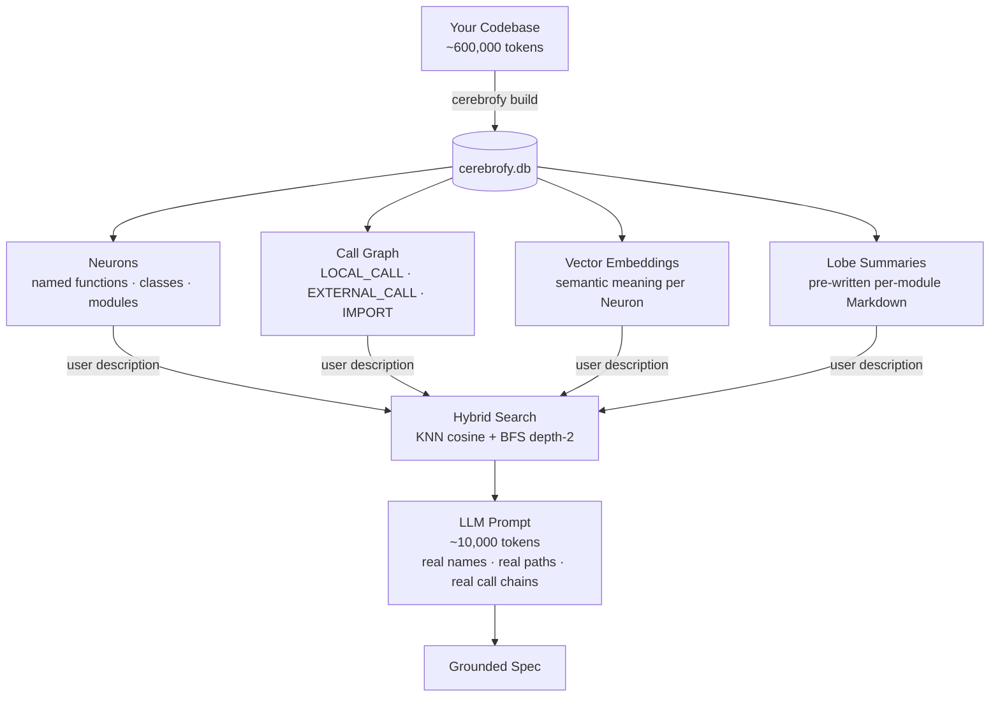

# 🧠 Cerebrofy

**AI-powered codebase intelligence CLI.**  
Cerebrofy indexes your repository into a local graph + vector database, then lets you explore it, plan changes, and generate AI-grounded feature specs — all from the command line, all with zero code uploaded to any server.

```
cerebrofy init && cerebrofy build
# → Parses, graphs, embeds — one local index, ready for AI tools
cerebrofy validate
# → clean
```

---

## The Problem: LLM Context Is Expensive

When you ask an AI agent to help with a feature in a real codebase, the naive approach is to dump files into the context window. That approach has three problems:

- **Cost**: a 20,000 LOC codebase is ~600,000 tokens per query
- **Noise**: the LLM reads code that is irrelevant to the task
- **Hallucination**: without structural grounding, the LLM guesses at call relationships and import paths

Cerebrofy solves this by pre-computing a structural + semantic index of your code. Instead of dumping files, it gives the LLM exactly what it needs:

| What the LLM receives | Token count | How it's selected |
|-----------------------|-------------|-------------------|
| 10 matched Neuron signatures | ~500 tokens | KNN cosine similarity search |
| Their depth-2 call graph | ~800 tokens | BFS over the `edges` table |
| 2–3 pre-written lobe summaries | ~8,000 tokens | Affected lobe `.md` files |
| **Total** | **~10,000 tokens** | vs. ~600,000 for raw files |

**~97% token reduction** on a typical mid-size codebase. The LLM gets a precise, grounded, zero-hallucination view of the code it actually needs — not a random 20-file dump.

### How Cerebrofy Grounds the LLM



The call graph answers the question an LLM cannot answer from code alone: **"if I change this function, what else breaks?"** Cerebrofy computes this once at build time with O(1) edge lookups — no approximation, no guessing.

---

## How It Works

Cerebrofy builds a **structural + semantic index** of your code in one SQLite file (`.cerebrofy/db/cerebrofy.db`):

1. **Parse** — Tree-sitter extracts named functions, classes, and modules as *Neurons*
2. **Graph** — Call relationships become typed edges (`LOCAL_CALL`, `EXTERNAL_CALL`, `RUNTIME_BOUNDARY`)
3. **Embed** — Each Neuron is embedded into a `sqlite-vec` vector table for semantic search
4. **Query** — Hybrid search (KNN cosine + BFS depth-2) finds affected code units for any description
5. **Expose** — An MCP stdio server lets AI clients trigger builds, run drift checks, and update the index

No cloud index. No code upload. One file, one connection.

---

## Installation

### Recommended: `uv tool install`

```bash
# Base install — includes local embeddings (BAAI/bge-small-en-v1.5, offline)
uv tool install cerebrofy

# With MCP server support (Claude Desktop, Cursor, VS Code, etc.)
uv tool install "cerebrofy[mcp]"
```

> **Note:** Embeddings are bundled in the base install via `fastembed`. No extra required for `cerebrofy build` or `cerebrofy update`. The only optional extra is `[mcp]`.

### Alternative installers

```bash
pip install cerebrofy
pipx install cerebrofy

# With MCP
pip install "cerebrofy[mcp]"
pipx install "cerebrofy[mcp]"
```

### From source

```bash
git clone https://github.com/mm0rsy/cerebrofy
cd cerebrofy
uv sync --group dev
```

Run tests:

```bash
# Unit + integration tests (no MCP)
uv run pytest tests/unit/ tests/integration/test_update_command.py \
  tests/integration/test_validate_command.py tests/integration/test_migrate_command.py \
  tests/integration/test_plan_command.py tests/integration/test_tasks_command.py \
  tests/integration/test_parse_command.py

# Full suite including MCP integration tests
uv sync --extra mcp --group dev
uv run pytest
```

---

## Quick Start

```bash
# 1. Initialize — scaffolds .cerebrofy/, installs git hooks, auto-detects Lobes
cerebrofy init

# 2. (Optional) Write AI navigation rules into your AI client's instructions file
cerebrofy init --ai claude        # → CLAUDE.md
cerebrofy init --ai copilot       # → .github/copilot-instructions.md
cerebrofy init --ai vscode        # → .github/copilot-instructions.md
cerebrofy init --ai opencode      # → .opencode/instructions.md

# 3. Build the index — parses all tracked files, builds call graph, generates embeddings
cerebrofy build

# 4. Keep the index in sync after code changes
cerebrofy update

# 5. Check for drift before pushing
cerebrofy validate
```

Once the index is built, AI assistants with MCP configured can call `cerebrofy_build`, `cerebrofy_update`, and `cerebrofy_validate` directly. Search and planning tools are registered but not yet operational — see [MCP Tools](#mcp-tools) for status.

---

## Commands

### `cerebrofy init`

Scaffold `.cerebrofy/`, auto-detect Lobes, install git hooks, and register the MCP server.

```bash
cerebrofy init                           # Local MCP registration (default)
cerebrofy init --global                  # Register MCP globally (~/.config/mcp/servers.json)
cerebrofy init --no-mcp                  # Skip MCP registration
cerebrofy init --force                   # Re-initialize, overwrite MCP entry with current binary path
cerebrofy init --ai claude               # Also write AI navigation rules to CLAUDE.md
cerebrofy init --ai copilot              # Also write rules to .github/copilot-instructions.md
cerebrofy init --ai vscode               # Same as --ai copilot
cerebrofy init --ai opencode             # Also write rules to .opencode/instructions.md
```

**What it creates:**

```
.cerebrofy/
├── config.yaml          ← Lobe map, tracked extensions, embed model
├── db/                  ← cerebrofy.db lives here (gitignored)
└── queries/             ← Tree-sitter .scm files per language
.cerebrofy-ignore        ← Ignore rules (gitignore syntax)
.gitignore               ← .cerebrofy/db/ appended automatically
.git/hooks/pre-push      ← Drift enforcement hook (warn-only until cerebrofy update verified)
.git/hooks/post-merge    ← state_hash sync check after git pull
```

The `--ai` flag appends a fenced navigation rules block to the target instructions file. The block is idempotent — re-running replaces the existing block rather than appending a second copy.

---

### `cerebrofy build`

Full atomic re-index of the repository.

```bash
cerebrofy build
```

Writes to `cerebrofy.db.tmp`, swaps atomically to `cerebrofy.db` only on success. An interrupted build leaves no corrupted state. Runs 6 steps:

| Step | Action |
|------|--------|
| 0 | Create `.tmp` database, apply schema |
| 1 | Parse all tracked source files → Neurons |
| 2 | Build intra-file call graph (LOCAL\_CALL edges) |
| 3 | Resolve cross-module calls (EXTERNAL\_CALL, IMPORT, RUNTIME\_BOUNDARY edges) |
| 4 | Generate embeddings for all Neurons (`BAAI/bge-small-en-v1.5`, 384-dim, offline) |
| 5 | Commit file hashes + state\_hash, atomic swap |
| 6 | Write per-lobe Markdown docs and `cerebrofy_map.md` |

---

### `cerebrofy update`

Partially re-index only changed files — target latency < 2s for a single-file change.

```bash
cerebrofy update                        # Auto-detect via git
cerebrofy update src/auth/login.py      # Explicit file list
```

Detects changes via `git diff` (falls back to file hash comparison in non-git repos). Uses depth-2 BFS to find and re-index all affected neighbors. All writes are wrapped in a single `BEGIN IMMEDIATE` transaction — on failure, full rollback.

After a successful update that completes in under 2 seconds, the pre-push git hook is automatically upgraded from warn-only (v1) to hard-block (v2).

---

### `cerebrofy validate`

Classify drift between the index and current source.

```bash
cerebrofy validate
```

Exit codes:

| Code | Meaning |
|------|---------|
| 0 | Index is clean, or minor drift (whitespace/comments only) |
| 1 | Structural drift — function added, removed, renamed, or signature changed |

This command is also invoked automatically by the pre-push git hook.

---

### `cerebrofy mcp`

Start the MCP stdio server. Used by AI tools (Claude Desktop, Cursor, VS Code, etc.) — not invoked manually.

```bash
cerebrofy mcp    # requires: uv tool install "cerebrofy[mcp]"
```

Exposes eight registered tools; three are fully operational: `cerebrofy_build`, `cerebrofy_update`, `cerebrofy_validate`. Five (`search_code`, `get_neuron`, `list_lobes`, `plan`, `tasks`) are stubs pending implementation of `search/hybrid.py` and related modules. See [docs/mcp-integration.md](docs/mcp-integration.md) for full setup.

---

### `cerebrofy migrate`

Run sequential schema migration scripts.

```bash
cerebrofy migrate
```

Scripts live in `.cerebrofy/scripts/migrations/`. Safe to run multiple times — already-applied migrations are skipped.

---

## MCP Tools

When configured via `cerebrofy init`, AI assistants can call these tools directly against your index:

| Tool | Status | Description |
|------|--------|-------------|
| `cerebrofy_build` | ✅ | Trigger a full atomic re-index from the AI client. |
| `cerebrofy_update` | ✅ | Trigger an incremental re-index. Pass `path` to target a specific file. |
| `cerebrofy_validate` | ✅ | Check for drift. Returns `clean`, `minor_drift`, or `structural_drift`. Zero writes. |
| `search_code` | 🚧 WIP | Hybrid semantic + keyword search. Requires `search/hybrid.py` (not yet implemented). |
| `get_neuron` | 🚧 WIP | Fetch a specific Neuron by name or file path. Requires DB schema alignment. |
| `list_lobes` | 🚧 WIP | List indexed lobes with neuron counts. Requires DB schema alignment. |

---

## Lobes

A **Lobe** is a named module group — typically one top-level directory in your repository. Cerebrofy auto-detects Lobes at `cerebrofy init` time. Each Lobe gets a Markdown documentation file at `docs/cerebrofy/<name>_lobe.md`.

Lobes are configured in `.cerebrofy/config.yaml`:

```yaml
lobes:
  auth: src/auth/
  api: src/api/
  db: src/db/
```

The lobe name surfaces in MCP tool output (`"lobe": "auth"`) and in lobe summary files used as AI context.

---

## Embedding Model

Cerebrofy uses **`BAAI/bge-small-en-v1.5`** via `fastembed`:

| Property | Value |
|----------|-------|
| Dimensions | 384 |
| Format | ONNX (no PyTorch) |
| Size | ~130 MB (cached after first `cerebrofy build`) |
| Offline | Yes — no API key, no network after first download |
| Extra required | None — bundled in base install |

---

## Language Support

Cerebrofy uses Tree-sitter with `.scm` query files. Supported out of the box:

`Python` · `JavaScript` · `TypeScript` · `TSX` · `JSX` · `Go` · `Rust` · `Java` · `Ruby` · `C++` · `C`

To add a new language, add a `.scm` query file to `.cerebrofy/queries/` and add the extension to `tracked_extensions` in `config.yaml`. See [docs/architecture.md](docs/architecture.md#adding-language-support) for details.

---

## Git Hooks

Cerebrofy installs two hooks at `cerebrofy init` time:

| Hook | Trigger | Behavior |
|------|---------|----------|
| `pre-push` | Before `git push` | Runs `cerebrofy validate`. Warns on minor drift; hard-blocks on structural drift after the hook is upgraded. |
| `post-merge` | After `git pull` / merge | Compares remote `state_hash` against local index; warns if out of sync. |

The pre-push hook starts in **warn-only** mode (v1). After `cerebrofy update` completes in under 2 seconds, it is automatically upgraded to **hard-block** mode (v2), preventing commits with a stale index from reaching the remote.

---

## Configuration

Full reference: [docs/configuration.md](docs/configuration.md)

Quick example `.cerebrofy/config.yaml`:

```yaml
lobes:
  auth: src/auth/
  api: src/api/

tracked_extensions:
  - .py
  - .ts
  - .go

embedding_model: local      # local | none
top_k: 10                   # default KNN results for plan/tasks
```

---

## Output Files

| Path | Created by | Description |
|------|-----------|-------------|
| `.cerebrofy/db/cerebrofy.db` | `cerebrofy build` | Full index — graph + vectors |
| `.cerebrofy/lobes/<name>_lobe.md` | `cerebrofy build` / `update` | Per-lobe Neuron + call table |
| `.cerebrofy/cerebrofy_map.md` | `cerebrofy build` / `update` | Master index with `state_hash` |

The lobe `.md` and map files are committed to git (not gitignored). They form the human-readable index of your codebase and serve as AI context when used with MCP tools.

---

## MCP Integration

Cerebrofy ships an MCP stdio server. Three tools are fully operational today (`cerebrofy_build`, `cerebrofy_update`, `cerebrofy_validate`); five additional tools are registered stubs pending implementation.

```bash
# Install with MCP support
uv tool install "cerebrofy[mcp]"

# Initialize — auto-registers the MCP entry with the absolute binary path
cerebrofy init

# Re-register if the binary moved (e.g. after reinstall)
cerebrofy init --force
```

See [docs/mcp-integration.md](docs/mcp-integration.md) for client-specific registration, manual setup, and per-tool schemas.

---

## Multi-Developer Workflow

`cerebrofy.db` is a **local artifact — it is not committed to git** (`.cerebrofy/db/` is gitignored automatically by `cerebrofy init`). Each developer builds and maintains their own index. Synchronization uses `state_hash` in `cerebrofy_map.md`, which **is** committed.

| Event | What happens |
|-------|-------------|
| First clone | `.cerebrofy/` missing → run `cerebrofy init && cerebrofy build`. Pre-push hook warns but does not block. |
| Daily development | Edit code → `cerebrofy update` syncs the index in < 2s. Pre-push hook validates automatically. |
| `git pull` / merge | Post-merge hook compares remote `state_hash` (from pulled `cerebrofy_map.md`) against local index. Warns if they differ — run `cerebrofy build` to resync. |
| Embedding model change | Change `embedding_model` in `config.yaml` → run `cerebrofy build` to rebuild the vector table at the new dimension. |

---

## Performance Targets

*Engineering targets validated against real repositories, not guaranteed results.*

| Metric | Target |
|--------|--------|
| Token reduction | ~97% — 20k LOC (~600k tokens) → 10 matched Neurons + lobe context (~15k tokens) |
| Blast radius query | < 10ms — depth-2 BFS on 10,000-node graph via indexed SQLite |
| `cerebrofy update` latency | < 2s — single-file change, end-to-end including re-embedding |
| `cerebrofy build` | Linear in codebase size; local embedding model (~130MB, cached after first run) |

---

## Contributing

- [Architecture guide](docs/architecture.md) — module map, data flow, invariants, database schema
- [Adding language support](docs/architecture.md#adding-language-support) — `.scm` query file authoring
- Tests: `uv run pytest` after `uv sync --group dev`
- Lint: `uv run ruff check src/ tests/`
- Type check: `uv run mypy src/`

---

## License

MIT
