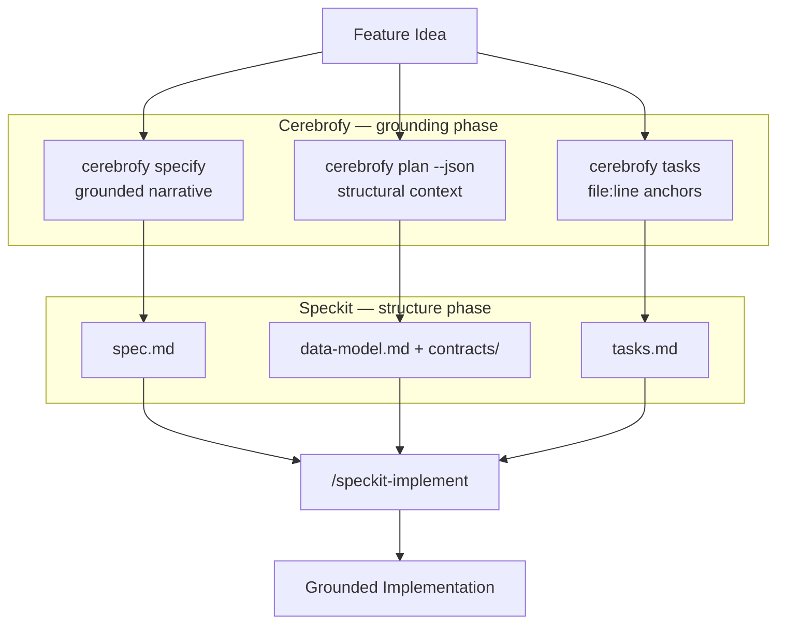

# Cerebrofy + Speckit Workflow

Cerebrofy and [Speckit](https://speckit.dev) are designed to work together. This guide walks through the full loop from a feature idea to an AI-implemented pull request, using both tools.

---

## The Problem with Spec-First Development

The standard speckit flow is:

```
idea → write spec.md → plan.md → tasks.md → /speckit-implement
```

The weak link is the first step. When you write `spec.md` by hand, the spec is only as accurate as your mental model of the codebase. You may reference a function by the wrong name, underestimate the blast radius of a change, or miss a dependency that only becomes visible when reading the actual call graph.

Cerebrofy eliminates that weak link by generating the spec from the live index — not from memory.

---

## The Combined Workflow



---

## Step-by-Step Walkthrough

This example adds a rate-limiting feature to a hypothetical API service.

### 1. Build the index (one-time setup)

```bash
cerebrofy init    # first time only
cerebrofy build   # indexes the codebase
```

### 2. Generate a grounded spec

```bash
cerebrofy specify "add per-IP rate limiting to the REST API with configurable limits per endpoint"
```

Cerebrofy runs a hybrid search, finds the most relevant code units, injects their lobe Markdown files as context, and calls the LLM. The output — written to `docs/cerebrofy/specs/<timestamp>_spec.md` — looks like:

```markdown
# Feature Specification: Per-IP Rate Limiting

## Overview
Add rate limiting to `api/middleware.py::handle_request` (line 42) and
`api/router.py::register_route` (line 87). Limits are configured per-endpoint
in `.cerebrofy/config.yaml` and enforced via a sliding window counter stored
in `db/cache.py::RateCache`.

## Affected modules
- **api** lobe: `handle_request`, `register_route`, `dispatch`
- **db** lobe: `RateCache`, `get_counter`, `increment_counter`

## Blast radius
Changing `handle_request` affects 7 downstream callers ...
```

Every function name and file path in this spec exists in the actual codebase — Cerebrofy verified them against the index before generating the spec.

### 3. Get the structural JSON

```bash
cerebrofy plan --json "add per-IP rate limiting" > /tmp/rate_limit_plan.json
```

```json
{
  "schema_version": 1,
  "matched_neurons": [
    { "id": "api/middleware.py::handle_request", "name": "handle_request",
      "file": "api/middleware.py", "line_start": 42, "similarity": 0.94 },
    { "id": "api/router.py::register_route", "name": "register_route",
      "file": "api/router.py", "line_start": 87, "similarity": 0.89 }
  ],
  "blast_radius": [
    { "id": "api/dispatch.py::dispatch", "name": "dispatch",
      "file": "api/dispatch.py", "line_start": 31 }
  ],
  "affected_lobes": ["api", "db"],
  "reindex_scope": 5
}
```

Use this JSON to fill in `data-model.md` (key entities affected) and `contracts/` (which interfaces will change).

### 4. Get the task list

```bash
cerebrofy tasks "add per-IP rate limiting"
```

```markdown
# Cerebrofy Tasks: add per-IP rate limiting

1. Modify handle_request in [[api]] (api/middleware.py:42) — blast radius: 4 nodes
2. Modify register_route in [[api]] (api/router.py:87) — blast radius: 2 nodes
3. Modify RateCache in [[db]] (db/cache.py:15) — blast radius: 1 nodes
```

This becomes the seed for `tasks.md` — each item points to the exact file and line number.

### 5. Create the speckit spec

```bash
speckit create "rate-limiting"
# creates: specs/006-rate-limiting/
```

Now populate each file:

**`specs/006-rate-limiting/spec.md`**
Take the narrative from `docs/cerebrofy/specs/<timestamp>_spec.md` and adapt it to the speckit template (user stories, acceptance criteria, FR-XXX requirements). The cerebrofy spec gives you the *what* and *where*; the speckit template structures the *why* and *acceptance criteria*.

**`specs/006-rate-limiting/data-model.md`**
Use the `matched_neurons` and `blast_radius` from `plan --json` to list the key entities being modified. Example:

```markdown
## Key Entities

- **RateLimitMiddleware** — wraps `handle_request`; new entity to be created
- **RateCache** (`db/cache.py:15`) — extended with per-endpoint sliding window counter
- **RouteConfig** (`api/router.py:87`) — gains `rate_limit` field per registered route
```

**`specs/006-rate-limiting/tasks.md`**
Adapt the `cerebrofy tasks` output into the speckit task format. The file:line references serve as anchors the implementing agent can jump to directly:

```markdown
## Phase: Core

- [ ] T001 [P] Add `RateLimitMiddleware` class wrapping `handle_request` (api/middleware.py:42)
- [ ] T002 [P] Extend `RateCache.get_counter` + `increment_counter` (db/cache.py:15)
- [ ] T003     Add `rate_limit` field to `RouteConfig` in `register_route` (api/router.py:87)
```

### 6. Implement

```bash
/speckit-implement specs/006-rate-limiting/tasks.md
```

The implementing agent now works from tasks that are:
- **Structurally grounded** — every file:line reference is verified against the live index
- **Blast-radius-aware** — the spec documents which downstream callers may be affected
- **LLM-grounded** — the spec narrative was generated with real lobe context, not invented

---

## Quick Reference: Cerebrofy Output → Speckit File

| Cerebrofy command | Output used in |
|-------------------|---------------|
| `cerebrofy specify "..."` | `spec.md` — copy and adapt the narrative sections |
| `cerebrofy plan --json "..."` | `data-model.md`, `contracts/` — key entities and interface boundaries |
| `cerebrofy tasks "..."` | `tasks.md` — implementation task list with file:line anchors |

---

## Tips

**Re-run specify after code changes.** `cerebrofy specify` reflects the current index. If you add new functions, run `cerebrofy update` before `cerebrofy specify` so the spec reflects the latest state.

**Use `--top-k` to control spec depth.** A higher `--top-k` includes more potentially affected code in the context. For large features touching many modules, `--top-k 20` produces a more comprehensive spec. For focused changes, the default of 10 is usually right.

**Keep the cerebrofy spec as a reference.** Don't delete `docs/cerebrofy/specs/<timestamp>_spec.md` after creating the speckit spec. It serves as a traceable record of what the codebase looked like when the spec was generated — useful during code review.

**`cerebrofy plan` is free.** It makes zero network calls. Use it freely to check blast radius before writing any spec or starting any implementation.
